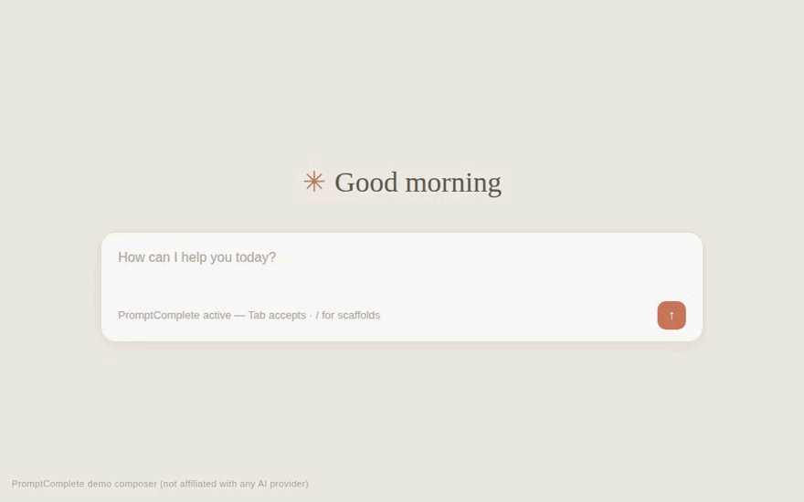
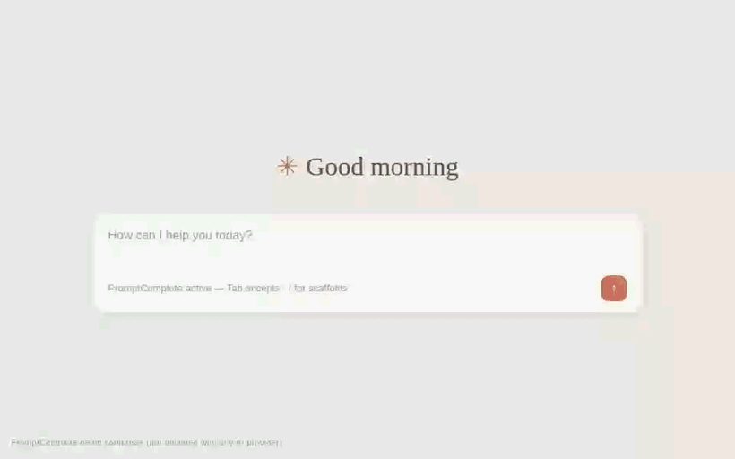
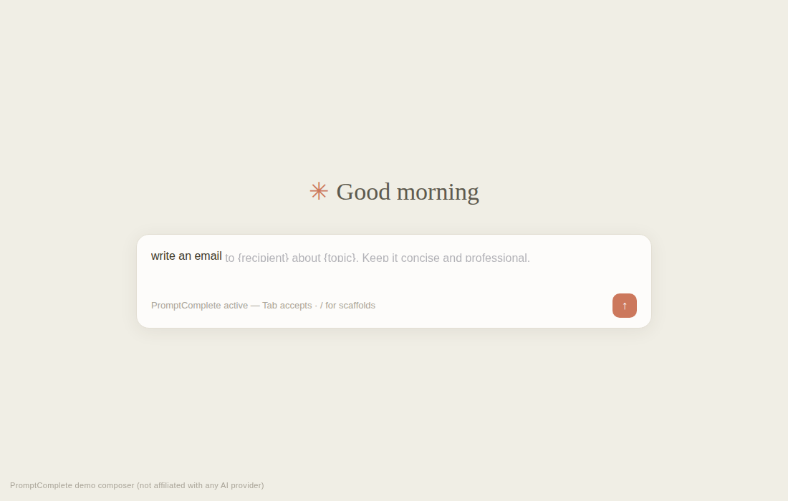
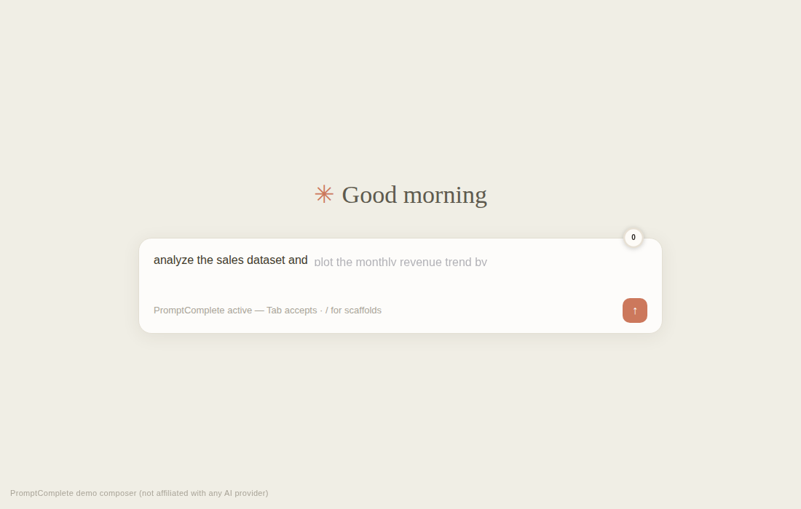
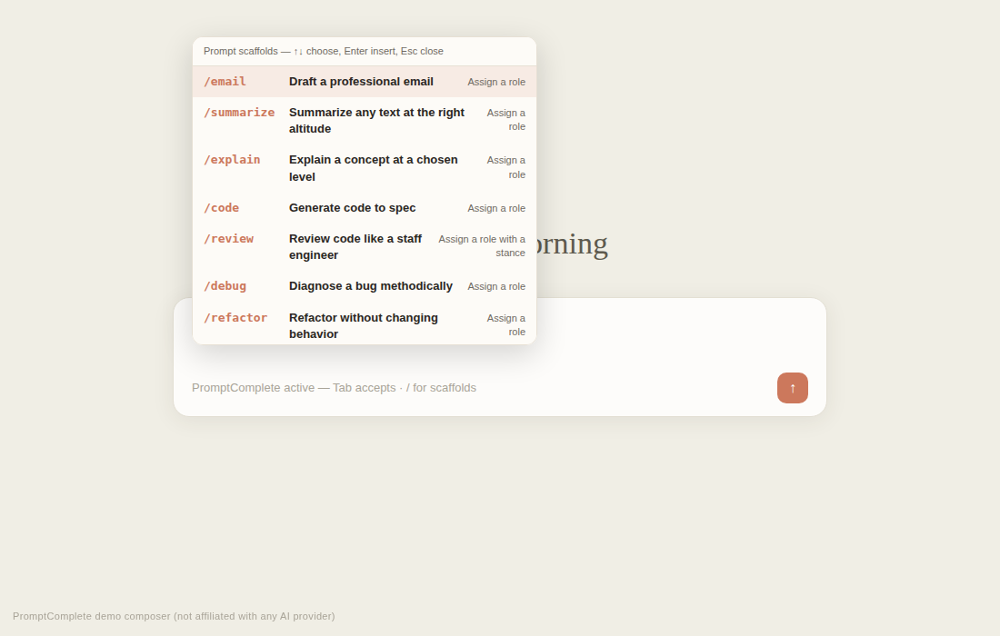
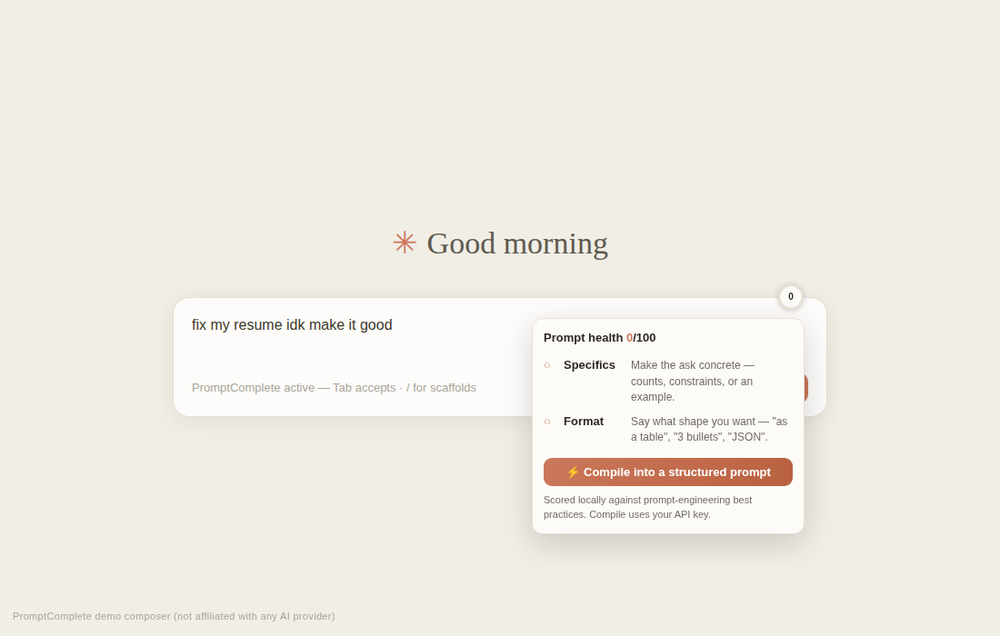
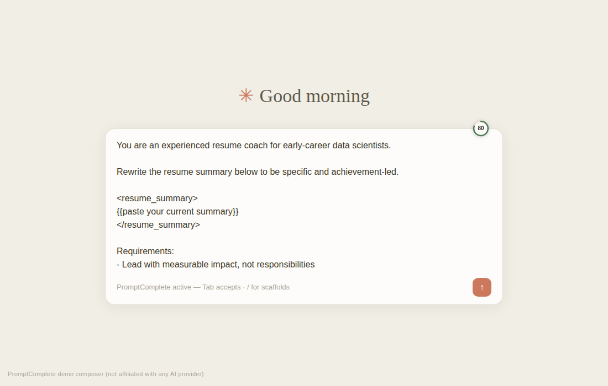

# PromptComplete

**The prompt box, upgraded to an IDE — inline autocomplete, a live prompt-quality
meter, one-click prompt compilation, and a local experiment lab. Claude-first.**

**The honest number** — the same prompt typed by hand vs. with PromptComplete,
counted live by a real keydown listener during the recording (nothing scripted):

Typing a good prompt is the slowest part of using an AI assistant. Gmail has Smart
Compose. Your editor has Copilot. The prompt box you type into every day has…
nothing. PromptComplete turns it into an IDE for prompts:

- **Ghost-text autocomplete** at the caret — `Tab` accepts, like Smart Compose.
- **Word completion that knows *you*** — type `h` and it ghosts `ello` because
  *you* say "hello" a lot: your own vocabulary (learned on-device from prompts
  you send) is checked first, then a real frequency-ranked English lexicon.
  And it judges the **entire phrase**: `analyze the sa` ghosts
  `les dataset and plot the monthly revenue` when the model is confident
  that's how you continue — every extra word must clear the same confidence
  gate, so long ghosts appear only for phrases you really write.
  Completions are **grammar-aware**: an agreement engine constrains every
  source, so `i want to creat` → *create* (never *created*), `i am creat` →
  *creating*, `we have creat` → *created*, `a sugg` → *suggestion* (never the
  frequency-favored plural), and `the the` is impossible.
- **Leading prompts** — when the predictors have nothing (an original draft),
  the ghost *leads* instead of going silent: it proposes the next missing
  prompt-engineering ingredient (`— be specific: {exact ask, numbers,
  constraints}.`), and each accept walks you to the next one.
- **Personalized from day one** — the model learns from every prompt you send,
  but you don't have to wait: **Settings → "Teach it my style"** trains it
  instantly from prompts you paste (or a one-click starter pack for your role —
  data scientist, engineer, writer). It runs the *same* on-device learning
  pipeline the composer uses, so completions are genuinely *yours*, not a fixed
  dictionary.
- **Prompt Health ring** — a live score of your draft against prompt-engineering
  best practices, with the missing ingredient named.
- **Intent Compiler** — one click turns a rough draft ("fix my resume idk make it
  good") into a structured, Claude-grade prompt.
- **`/` scaffold palette** — 16 curated prompt patterns (roles, XML tags, examples,
  chain-of-thought, output formats) with Tab-navigable `{{placeholders}}`.
- **Placeholder Fill Card** — accepting an overview template pops a small card
  with one input per `{placeholder}`. Each row offers chips from two sources:
  the **personal model queried with the surrounding context** (after
  "email to…" it proposes *my manager* because that's what *you* write there)
  plus curated type suggestions. Enter substitutes everything; Esc keeps the
  placeholders. Word/phrase completions never pop it.
- **Prompt Lab** — every sent prompt logged locally like an ML experiment: health
  score, size, missing techniques, plus your acceptance-rate trend over time.
- **Garble repair** — badly-typed tails ("computign", "understandingkinda") get a
  "Did you mean" chip with the cleaned version; `Ctrl+.` applies. True
  Damerau–Levenshtein BK-tree search ranked by word frequency, entirely
  on-device.

Built Claude-first with a warm Claude-flavored theme. Also works on ChatGPT.

<em>typed text</em> <code>│</code> <em>ghost suggestion…</em> &nbsp;→&nbsp; <kbd>Tab</kbd>

---

## Why it's interesting (the data science inside)

This is a working applied-ML system, not a snippet list:

- **An interpolated Kneser–Ney language model** — the smoothing family production
  n-gram systems use — trained incrementally on *your own* prompts, entirely
  on-device, with continuation counts maintained O(1) at index time.
- **A text-analytics pipeline** — clean/parse → stem (with overstemming guards) →
  chunk (sliding n-gram windows) → index — each stage a pure, tested function.
- **Vector-space retrieval** — curated templates matched by cosine similarity over
  stem TF vectors when the regex fast-path misses a paraphrase.
- **Confidence-gated decoding** — the model emits only while `P(w|h) ≥ 0.45` with
  support ≥ 2: silence beats a wrong guess (precision over recall, by design).
- **A built-in eval loop** — acceptance rate (the canonical autocomplete metric),
  daily time-series trend, descriptive statistics, and one-click dataset export.
- **Real data structures, really measured** — prefix completion runs on a
  weighted top-K trie (**255× faster** than a linear scan, p50 0.72µs, zero
  correctness mismatches), spell repair on a true Damerau–Levenshtein
  **BK-tree** (2.1× faster than Norvig candidate generation at identical
  accuracy, worst-case p95 36.9ms → 10.7ms), and phrase prediction on
  **width-3 beam search** gated by joint probability. Every number
  reproduces via `npm run bench` on real corpus data — see
  [`docs/ALGORITHMS.md`](docs/ALGORITHMS.md).
- **A real data source, reproducibly** — the spelling/word-completion lexicon
  (`src/lexicon.js`, ~10k words) is generated from the
  [google-10000-english](https://github.com/first20hours/google-10000-english)
  frequency list, itself derived from Google's Web Trillion Word Corpus
  (Brants & Franz, LDC2006T13). `node tools/build-lexicon.mjs` re-downloads
  the dataset and rebuilds the file — provenance in the generated header, no
  hand-invented frequencies. Template lead-ins are validated the same way,
  against the CC0 [awesome-chatgpt-prompts](https://github.com/f/awesome-chatgpt-prompts)
  corpus (`tools/analyze-prompts.mjs`). Full provenance: [`docs/DATA.md`](docs/DATA.md).

Full design + formulas: [`docs/ARCHITECTURE.md`](docs/ARCHITECTURE.md).

## Latency by design

| Path | Budget |
|---|---|
| Keystrokes that match the ghost | **0 ms** — type-through consumes it in place, no recompute, no flicker |
| Local tiers (model + templates + IR) | **< 1 ms** after an 80 ms debounce |
| Index structures (trie + BK-tree) | built once at idle, pre-warmed off the keystroke path |
| AI tier (opt-in) | streams token-by-token after a further 350 ms quiet gap; in-flight requests abort server-side on the next keystroke |
| Training | runs at send time — never on the keystroke path |

## Keyboard

| Key | Action |
|---|---|
| `Tab` | Accept the whole suggestion |
| `Ctrl/Cmd+→` | Accept one word |
| `Alt+]` / `Alt+[` | Cycle alternative suggestions |
| `Esc` | Dismiss |
| `Ctrl/Cmd+.` | Apply the "did you mean" garble repair |
| `/` at start | Open the scaffold palette |
| `Tab` (after scaffold) | Jump to next `{{placeholder}}` |

## Install (developer mode)

1. Clone this repo.
2. `node tools/gen-icons.mjs` (one time).
3. `chrome://extensions` → **Developer mode** → **Load unpacked** → select this
   folder (Chrome, Edge, Brave — any Chromium browser).
4. Open [claude.ai](https://claude.ai) and start typing.

**AI mode (optional):** open Settings, switch the source to **AI**, paste your
Anthropic API key. Ghost completions default to `claude-haiku-4-5` (latency);
the Intent Compiler defaults to `claude-sonnet-5` (quality). Your key lives in
your browser's extension storage and is sent only to `api.anthropic.com`.

Run the tests: `npm test` (67 unit tests, zero dependencies) and
`npm run test:e2e` (37 Playwright assertions: every keyboard interaction in
the demo composer, all three extension pages, and a real-Chrome load of the
unpacked extension with its MV3 service worker). `npm run bench` reproduces
every performance and accuracy number in
[`docs/ALGORITHMS.md`](docs/ALGORITHMS.md) — deterministic, on real data.

## Live demo (no install)

`demo/composer.html` is a Claude-style demo composer that runs the **real,
unmodified extension scripts** against a stubbed `chrome.*` API — open it in
any browser to feel the ghost text, health ring, and `/` palette without
loading the extension. `node demo/capture.mjs` drives it with Playwright and
captures the screenshots in `demo/shots/` (it doubles as the E2E test — it
caught a real template-duplication bug that is now covered by the unit suite).

| Ghost text | Personal model | `/` palette |
|---|---|---|
|  |  |  |

**The Intent Compiler**, before and after — a rough draft scoring **0** on the
health ring becomes a structured prompt scoring **80** with one click. (In the
demo the rewrite is a canned representative example; in the real extension this
call goes to Claude Sonnet with your key.)

| Draft: "fix my resume idk make it good" — health 0 | Compiled — health 80 |
|---|---|
|  |  |

**▶ Full 42-second product tour with captions:**
[`demo/shots/tour.webm`](demo/shots/tour.webm) — every feature in one take
(ghost text → personal model → `/` scaffolds with placeholder jumping → health
ring → Intent Compiler). Regenerate with `node demo/video.mjs`.

`node demo/record.mjs` regenerates the hero GIF — Playwright video → PNG
frames → an animated GIF assembled by our own dependency-free GIF89a encoder
([`tools/gif.mjs`](tools/gif.mjs): PNG decode, palette quantization, LZW).

## How it works

| Piece | File | Role |
|---|---|---|
| Content script | `src/content.js` | Composer detection, ghost rendering, keyboard, health ring, analytics |
| Suggestion engine | `src/suggest.js` | KN language model + curated templates + vector-space IR |
| Health engine | `src/health.js` | 5-dimension best-practice scoring, length-scaled |
| Garble repair | `src/repair.js` | Damerau–Levenshtein BK-tree query (Norvig generation as fallback) |
| Index structures | `src/trie.js`, `src/bktree.js` | Weighted top-K trie (O(prefix) completion) + metric tree (pruned edit-distance search) |
| Lexicon (generated) | `src/lexicon.js` | ~10k words from the google-10000-english dataset; rebuild via `tools/build-lexicon.mjs` |
| Scaffolds | `src/templates.js`, `src/palette.js` | Curated prompt patterns + `/` palette + snippet mode |
| Service worker | `src/background.js` | Streaming completions over a port (real abort), Intent Compiler |
| Insights | `dashboard/` | Acceptance analytics, time series, Prompt Lab, export |
| Popup / Settings | `popup/`, `options/` | Toggles, models, key |

## Privacy

Local by default: the model, analytics, and settings never leave your browser.
Your personal model is portable — export/import it as JSON from Settings to
back it up or move machines.
The Prompt Lab stores **no prompt text** — only structure (length, score, missing
techniques). In AI mode the only outbound request is the one you authorize, with
your own key, directly to Anthropic. No PromptComplete server. No telemetry.

## The bigger picture

PromptComplete is the free personal tier of a larger offering — shared team
prompt packs, org-wide curation, and acceptance analytics as seat-activation
evidence. See [`docs/PITCH.md`](docs/PITCH.md) (product & business),
[`docs/STRATEGY.md`](docs/STRATEGY.md) (the Anthropic pain points it targets),
and [`docs/ARCHITECTURE.md`](docs/ARCHITECTURE.md) (the pipeline).

## License

MIT — see [`LICENSE`](LICENSE).
